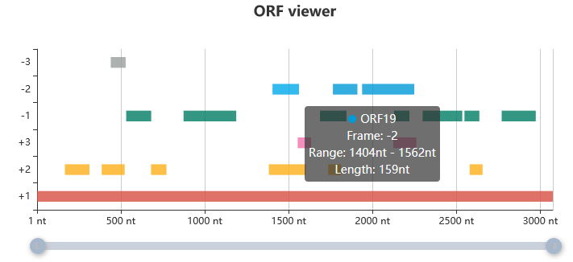

# ORFViewer

>This tool is only for graphical disaplay of ORFs and does not include ORF recognition (P.S., The purpose of doing this is to better display the results after ORF recognition :)).

>For ORF identification, please refer to: https://github.com/atlasbioinfo/ORF-finder

## Usage

```javascript
//These parameters need to be self-defined in script.js
// You can design user input fields and use ORF-Finder to calculate the corresponding ORF information
// Then transfer the information into script.js

let geneLength=3075;
let orfInfo=[
    {"name":"ORF1","label":0,"beg":1,"end":3075},
    {"name":"ORF2","label":1,"beg":167,"end":313},
    {"name":"ORF3","label":1,"beg":386,"end":523},
    {"name":"ORF4","label":1,"beg":680,"end":772},
    {"name":"ORF5","label":1,"beg":1382,"end":1603},
    {"name":"ORF6","label":1,"beg":1736,"end":1813},
    {"name":"ORF7","label":1,"beg":2579,"end":2656},
    {"name":"ORF8","label":2,"beg":1554,"end":1634},
    {"name":"ORF9","label":2,"beg":2124,"end":2261},
    {"name":"ORF10","label":3,"beg":2770,"end":2973},
    {"name":"ORF11","label":3,"beg":2548,"end":2637},
    {"name":"ORF12","label":3,"beg":2299,"end":2535},
    {"name":"ORF13","label":3,"beg":2128,"end":2220},
    {"name":"ORF14","label":3,"beg":1687,"end":1845},
    {"name":"ORF15","label":3,"beg":874,"end":1188},
    {"name":"ORF16","label":3,"beg":532,"end":681},
    {"name":"ORF17","label":4,"beg":1938,"end":2249},
    {"name":"ORF18","label":4,"beg":1764,"end":1910},
    {"name":"ORF19","label":4,"beg":1404,"end":1562},
    {"name":"ORF20","label":5,"beg":440,"end":529}
]
```

## Method

The graphical implementation of the ORFviewer is based on [Echats](
www.echartsjs.com).

Tools support graphical displays, toolbars, zooming and clicking events.



Visualize 6 ORF reading frames (+1, +2, +3, -1, -2 ,-3).

## To-do

1. Add arrows to make the reading frame clearer
